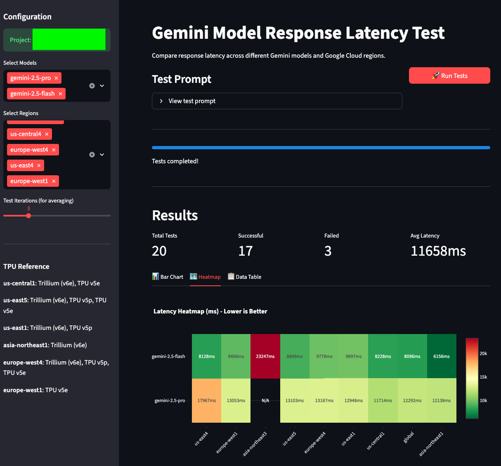

# Gemini Response Latency Test

## Setup

### 1. Set Environment Variables

Create a `.env` file and set the following environment variables:

```bash
PROJECT_ID=your-project-id
TEST_ITERATIONS=3
```

### 2. Google Cloud Authentication

Set up application default credentials using gcloud CLI:

```bash
gcloud auth application-default login
```

Running this command will open a browser where you can log in with your Google account to grant permissions.

## Run

```bash
pip install -r requirements.txt
```

```bash
streamlit run app.py
```


